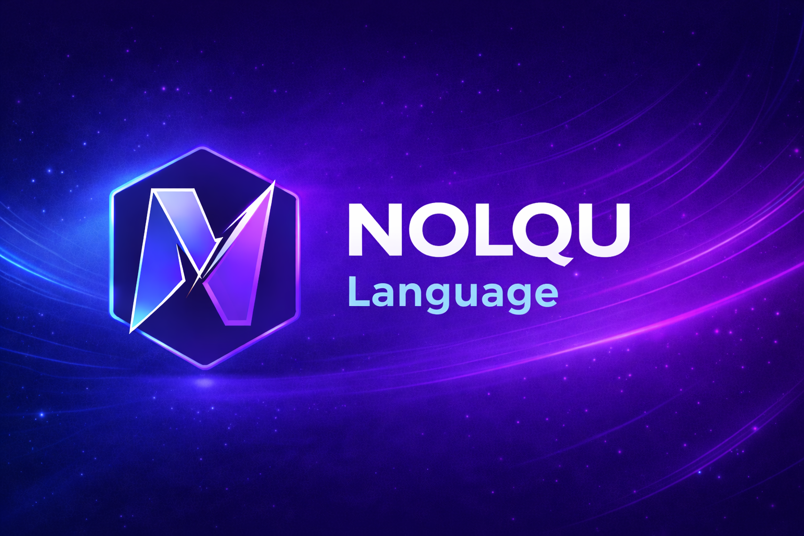

<h1 align="center">Nolqu</h1>

Official development account for <b>NolquLang</b>

---

## About

**NolquLang** is a modern scripting language currently under development.

The goal of Nolqu is to build a simple, fast, and embeddable programming language with its own virtual machine and ecosystem.

---

## Nolqu Ecosystem

The Nolqu ecosystem is planned to include several components.

### Core
- **NolquLang** — The programming language
- **Nolqu VM** — Bytecode virtual machine
- **Nolqu Compiler**

### Tools
- **Nolqu CLI**
- **Nolqu Playground**
- **Nolqu Formatter**

### Libraries
- **Nolqu Standard Library**
- **Nolqu Modules**

### Documentation
- Language documentation
- Tutorials
- Examples

---

## Development

Official development happens here:

https://github.com/NolquDev

Main project repository:

https://github.com/Nadzil123/Nolqu

---

## Maintainer

Nolqu is created and maintained by:

**Nadzil**

Creator of **NolquLang**

---

⭐ Follow this organization to stay updated on the Nolqu ecosystem.
